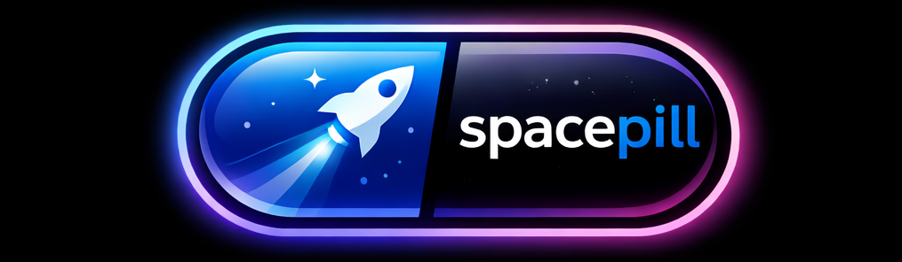
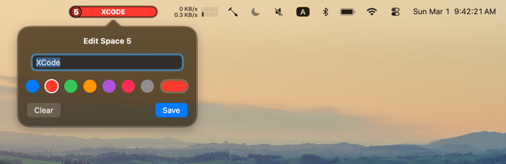
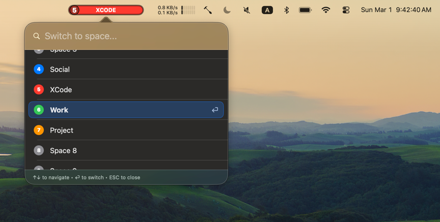

<p align="center">
  
</p>


[](https://opensource.org/licenses/MIT)
[](https://swift.org)
[](https://www.apple.com/macos/)


SpacePill is a lightweight native macOS menu bar application designed help you navigate multipe Spaces. 


## ✨ Screenshots & Features 

* Pill-style Indicator: optionally color coded to help you know what Space you're on. 
  
    

* Change the name and color of your space via global hot key. (Default cmd+shift+S)

    

* Quickly navigate to a new space by label or number via global hot key. (Defaul cmd+shift+J)

    

## 📦 Installation

### Direct Download 

[Download the latest release](https://github.com/jakequist/spacepill/releases)

### Homebrew
```bash
brew tap jakequist/spacepill https://github.com/jakequist/spacepill
brew install spacepill
```

### Build from Source
```bash
# Clone the repository (using SSH)
git clone git@github.com:jakequist/spacepill.git
cd spacepill

# Build and run
./bin/start.sh
```


## ⌨️ Hotkeys

| Action | Shortcut |
| :--- | :--- |
| **Quick Edit Space** | `⌘ + ⇧ + S` |
| **Quick Switch Bar** | `⌘ + ⇧ + J` |
| **Context Menu** | `Right Click` on menu item |

**Permissions:** Note that accessibility permissions will be required for the Quick Switch Bar (System Settings -> Privacy & Security -> Accessibility).


## 🏛️ Prior Art

SpacePill stands on the shoulders of many great macOS window and space management tools. Our goal is to provide a lightweight, native-feeling enhancement to the built-in macOS Spaces experience.

If SpacePill doesn't quite fit your workflow, you might find what you're looking for in one of these excellent tools:

| Tool                                                             | Focus                    | Comparison with SpacePill                                                                                             |
|:-----------------------------------------------------------------|:-------------------------|:----------------------------------------------------------------------------------------------------------------------|
| **[Spaces Renamer](https://github.com/dado3212/spaces-renamer)** | Naming Spaces            | A more direct "competitor" focused solely on renaming. SpacePill adds navigation and color-coding.                    |
| **[yabai](https://github.com/koekeishiya/yabai)**                | Tiling Window Management | Powerful BSP-style tiling. Requires disabling SIP for advanced features. Much steeper learning curve.                 |
| **[AeroSpace](https://github.com/nikitabobko/AeroSpace)**        | i3-style Tiling          | Virtual workspaces that ignore native macOS Spaces. Great for i3 fans, but can be jarring if you use Mission Control. |
| **[Amethyst](https://github.com/ianyh/Amethyst)**                | Automatic Tiling         | Works out of the box with native Spaces. Focuses on window layout rather than space naming/navigation.                |
| **[Rectangle](https://rectangleapp.com/)**                       | Window Snapping          | The gold standard for manual window resizing. Complements SpacePill perfectly as it doesn't manage spaces.            |
| **[SubSpace](https://github.com/Jaysce/Spaceman)**               | Menu Bar Visuals         | Menu bar visual indicator of your current space.                                                                      |

**Why choose SpacePill?**
I made SpacePill because (a) I wanted a color-based visual indicator of my current space (i.e. different colors help my brain to quickly context switch) and (b) I wanted a quick-switch feature that allows me to switch to a target space based on keyword.  And and (c) I wanted hotkeys to be a first class citizen.  


## 🔒 Privacy & Permissions
SpacePill requires Accessibility permissions to simulate the native macOS "Switch to Desktop" shortcuts. It uses private SkyLight APIs to detect space IDs and transitions. SpacePill does not collect any data or connect to the internet.

