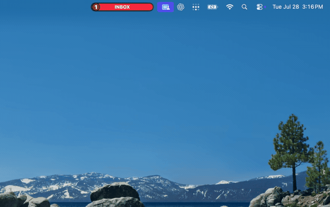

<p align="center">
  
</p>

<p align="center">
  <b>A colour-coded pill in your menu bar that tells you which macOS Space you're on —<br>and lets you jump to any of them by name.</b>
</p>

<p align="center">
  <a href="#-install">Install</a> ·
  <a href="https://jakequist.github.io/spacepill/">Documentation</a> ·
  <a href="https://github.com/jakequist/spacepill/releases/latest">Download</a>
</p>

<p align="center">
  <a href="https://opensource.org/licenses/MIT"></a>
  <a href="https://swift.org"></a>
  <a href="https://www.apple.com/macos/"></a>
  <a href="https://github.com/jakequist/spacepill/releases/latest"></a>
</p>

<p align="center">
  
</p>

---

macOS Spaces are great until you have six of them and every one looks identical.
**SpacePill** turns your current Space into a big, coloured, named pill in the
menu bar — so you always know where you are — and adds a fast keyboard switcher
so you can jump straight to "Docs" or "Review" without swiping through them all.

It's a single native app. No dependencies, no background services, no network
access. Just a pill in your menu bar.

> **Why it exists:** I run a lot of coding agents in parallel, one per Space.
> Numbered desktops all blur together, so I kept losing track of which agent was
> where. Colour and a name fix that at a glance, and jumping by keyword beats
> cycling through ten desktops.

## ✨ What it does

### Always know where you are

Your current Space shows up as a coloured pill with its number and label. Give
each Space a colour and your brain learns the layout — green is Docs, red is
Code — without reading a word.

<p align="center">
  
</p>

### Jump to any Space by name — <kbd>⌘</kbd><kbd>⇧</kbd><kbd>J</kbd>

Open the switcher and start typing. It fuzzy-matches, so `dcs` finds **Docs**
and `rev` finds **Review**. Hit <kbd>⏎</kbd> and you're there.

<p align="center">
  
</p>

### Name and colour a Space in two keystrokes — <kbd>⌘</kbd><kbd>⇧</kbd><kbd>S</kbd>

Type a label, pick a colour, done. Labels stick to the Space even when you
reorder your desktops in Mission Control.

<p align="center">
  
</p>

### Keep notes per Space — <kbd>⌘</kbd><kbd>⇧</kbd><kbd>N</kbd>

A little Markdown scratchpad that belongs to the current Space and follows you
as you switch. Great for a per-project checklist or a scratch buffer next to
whatever you're working on.

<p align="center">
  
</p>

## 📦 Install

**Install script** — the quickest way. Downloads the latest signed release,
installs it to `/Applications`, and launches it:

```sh
curl -fsSL https://jakequist.github.io/spacepill/install.sh | sh
```

**Direct download** — grab `SpacePill.dmg` from the
[latest release](https://github.com/jakequist/spacepill/releases/latest) and
drag it to Applications. Builds are signed and notarised by Apple, so they open
with no warnings.

SpacePill lives in your menu bar — there's no Dock icon and no window. On first
launch a short **Setup** panel walks you through granting Accessibility (so it
can switch Spaces for you) and turning on macOS's desktop-switching shortcuts.
It takes a few seconds and you only do it once.

## ⌨️ Hotkeys

| Action | Shortcut |
| :--- | :--- |
| Rename / recolour the current Space | <kbd>⌘</kbd><kbd>⇧</kbd><kbd>S</kbd> |
| Jump to a Space by name | <kbd>⌘</kbd><kbd>⇧</kbd><kbd>J</kbd> |
| Space notes | <kbd>⌘</kbd><kbd>⇧</kbd><kbd>N</kbd> |
| Preferences / Quit | Right-click the pill |

All of them are rebindable in Preferences.

## 🖥️ Command line

SpacePill ships with a `spacepill` CLI so you can script it — jump to a Space,
read or write its notes, or check your setup:

```sh
spacepill switch Docs        # jump to the Space labelled "Docs"
spacepill current            # what Space am I on?
spacepill notes              # print the current Space's notes
spacepill doctor             # check permissions and setup
```

Run `spacepill help` for the full command list.

## 🔒 Privacy

SpacePill collects nothing and connects to nothing — it contains no networking
code at all. Your labels, colours, and notes are plain files under
`~/.spacepill/` on your Mac, and nowhere else.

## 📚 More

- **[Documentation](https://jakequist.github.io/spacepill/)** — full guide, CLI reference, and troubleshooting
- **[Contributing](CONTRIBUTING.md)** — build from source and hack on it
- Built with ❤️ by [Jake Quist](https://github.com/jakequist) · [MIT licensed](LICENSE)

<details>
<summary><b>Prior art & alternatives</b></summary>

<br>

SpacePill is intentionally small: a visual indicator and a fast switcher for
*native* macOS Spaces. If you want something different, these are excellent:

| Tool | Focus |
| :--- | :--- |
| [Spaces Renamer](https://github.com/dado3212/spaces-renamer) | Renaming Spaces (no navigation or colour) |
| [Spaceman](https://github.com/Jaysce/Spaceman) | A menu bar indicator of your current Space |
| [yabai](https://github.com/koekeishiya/yabai) | Powerful BSP tiling; steeper setup, needs SIP off for some features |
| [AeroSpace](https://github.com/nikitabobko/AeroSpace) | i3-style virtual workspaces that bypass native Spaces |
| [Amethyst](https://github.com/ianyh/Amethyst) | Automatic tiling on top of native Spaces |
| [Rectangle](https://rectangleapp.com/) | The gold standard for window snapping (pairs well with SpacePill) |

SpacePill's niche: **colour-coded** indication, **keyword** switching, and
**hotkeys as a first-class citizen**.

</details>
