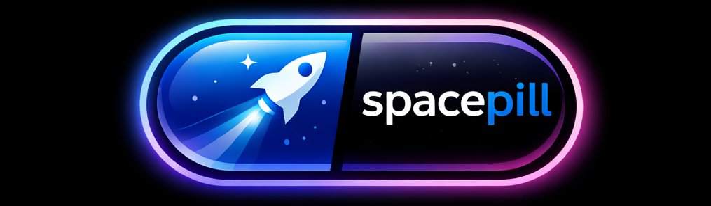
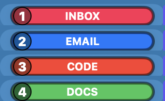
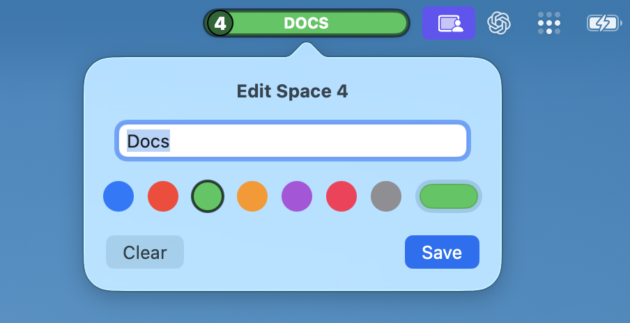
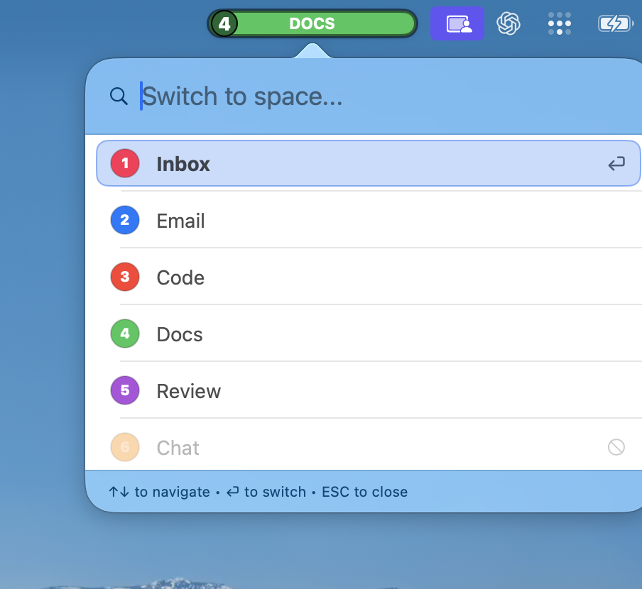
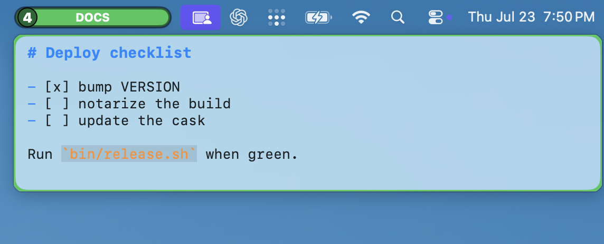
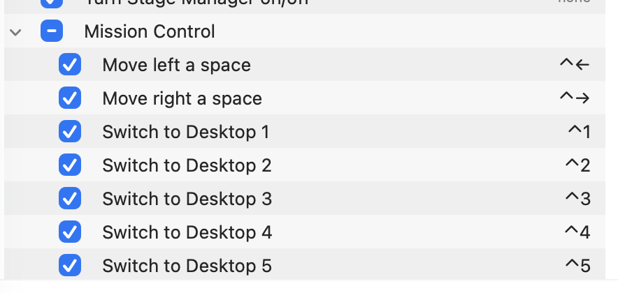
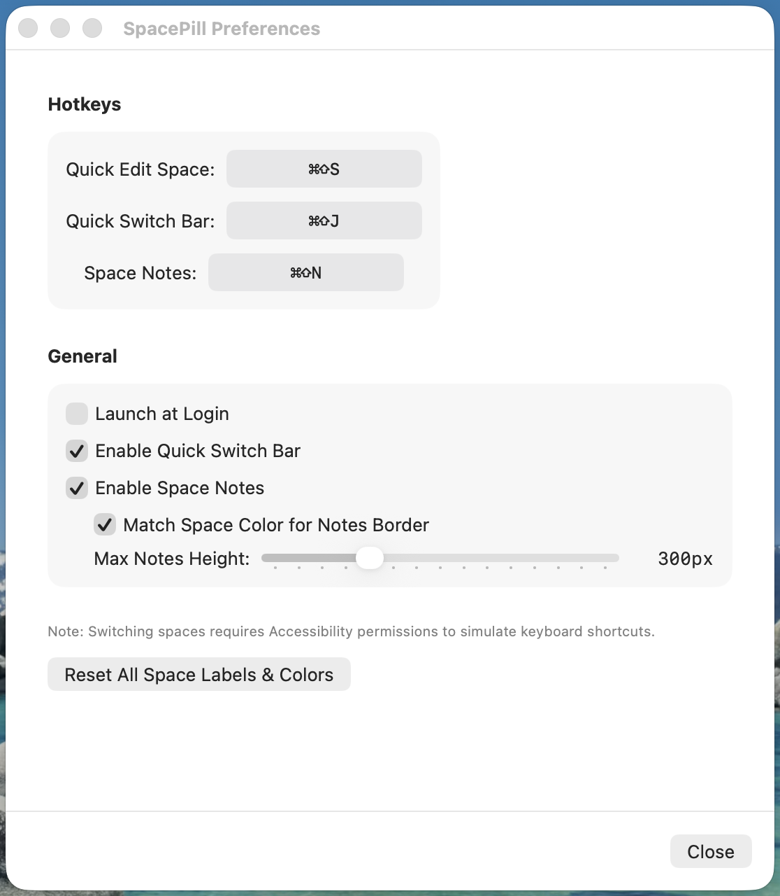
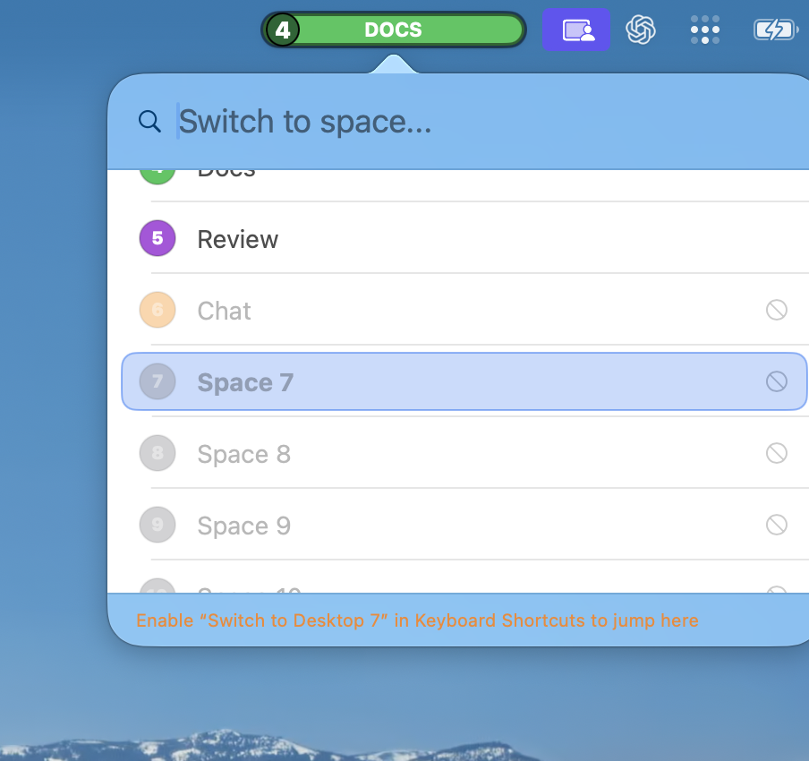

<p align="center">
  
</p>

<p align="center">
  <b>Know which macOS Space you're on. Jump to any of them by name.</b>
</p>

<p align="center">
  <a href="https://opensource.org/licenses/MIT"></a>
  <a href="https://swift.org"></a>
  <a href="https://www.apple.com/macos/"></a>
</p>

<p align="center">
  <a href="https://jakequist.com/spacepill/">Documentation</a> ·
  <a href="https://github.com/jakequist/spacepill/releases">Download</a> ·
  <a href="#-required-setup">Required setup</a> ·
  <a href="#-prior-art">Prior art</a>
</p>

---

SpacePill is a small, native macOS menu bar app for people who live in a lot of
Spaces. It puts a big colour-coded pill in your menu bar showing exactly where
you are, and adds three global hotkeys: relabel the current Space, jump to a
Space by typing part of its name, and keep Markdown notes that follow each
Space around.

<p align="center">
  
</p>

**Why it exists:** I run a lot of coding agents in parallel — one agent per
Space. Numbered desktops all look identical, so I kept losing track of which
one had which agent in it. Colour plus a name fixes that in peripheral vision,
and a keyword jump beats cycling through ten desktops with `⌃→`.

No third-party dependencies. No network access. No telemetry. One `.app`, about
as light as a menu bar app gets.

---

## ✨ What you get

### A pill that tells you where you are

The menu bar shows the current Space's number and label in whatever colour you
assigned it. Unconfigured Spaces get a neutral pill; the number badge is always
there.

<p align="center">
  
</p>

<p align="center">
  
</p>

### Quick Edit — name and colour a Space `⌘⇧S`

Type a label, pick one of seven presets or any custom colour, hit Return. Labels
and colours are keyed by the Space's UUID, so they survive reordering your
desktops in Mission Control. Clicking the pill opens the same popover.

<p align="center">
  
</p>

### Quick Switch — jump by name `⌘⇧J`

Start typing part of a Space's label (or its number) and press Return. `↑`/`↓`
to move, `Esc` to dismiss.

<p align="center">
  
</p>

### Space Notes — a scratchpad per Space `⌘⇧N`

A floating Markdown panel bound to the current Space. It swaps content the
instant you switch, saves as you type, highlights Markdown syntax, and continues
list markers when you press Return. Its border can pick up the Space's colour.

<p align="center">
  
</p>

---

## 📦 Installation

### Homebrew

```bash
brew tap jakequist/spacepill https://github.com/jakequist/spacepill
brew install --cask spacepill
```

### Direct download

Grab the latest `SpacePill.dmg` from the
[releases page](https://github.com/jakequist/spacepill/releases) and drag it to
`/Applications`.

### Build from source

Requires Xcode 15 / Swift 5.9 or newer. No dependencies to fetch.

```bash
git clone https://github.com/jakequist/spacepill.git
cd spacepill
./bin/dev-cert.sh   # once per machine: stable signing identity so permissions stick
./bin/start.sh      # build, bundle, run
```

See [CONTRIBUTING.md](CONTRIBUTING.md) for the full development loop.

---

## ⚠️ Required setup

> [!IMPORTANT]
> **macOS ships the "Switch to Desktop N" keyboard shortcuts turned off.**
> There is no public or private API to activate a Space directly, so SpacePill
> switches Spaces by replaying those shortcuts. On a stock Mac they don't
> exist — which means **Quick Switch cannot move you anywhere until you enable
> them.** This is the number one reason SpacePill looks broken. It takes about
> thirty seconds to fix.

### 1. Enable the Desktop shortcuts

Open **System Settings → Keyboard → Keyboard Shortcuts… → Mission Control**,
expand **Mission Control**, and tick **Switch to Desktop 1**, **Switch to
Desktop 2**, and so on for as many desktops as you use.

<p align="center">
  
</p>

You can rebind them to whatever you like — SpacePill reads your actual bindings
rather than assuming `⌃1`…`⌃0`, and re-reads them every time you open Quick
Switch, so you don't have to restart the app.

> Enable these through the System Settings UI. Writing to
> `com.apple.symbolichotkeys` with `defaults write` does not take effect until
> the WindowServer reloads at login.

### 2. Turn on the features you want

Quick Switch and Space Notes are **off by default**. Right-click the pill →
**Preferences…** and enable them. Quick Edit works out of the box.

<p align="center">
  
</p>

### 3. Grant permissions

macOS will prompt the first time SpacePill needs them. Both live under
**System Settings → Privacy & Security**.

| Permission | What it's actually for | If you say no |
| :--- | :--- | :--- |
| **Accessibility** | Posting the "Switch to Desktop N" keystrokes on your behalf. This is the whole switching mechanism. | Quick Switch cannot change Spaces. Everything else works. |
| **Input Monitoring** | Watching for `⌃←` / `⌃→` so the pill updates the moment a transition *starts*, instead of after it finishes. Nothing else. | Everything still works. The pill just lags about a second behind arrow-key switches. |

Input Monitoring sounds scarier than it is, and it's fair to be suspicious of
it. SpacePill uses a listen-only event tap that looks at one thing: whether the
keystroke was `Ctrl` plus a left or right arrow. Keystrokes are never recorded,
stored, or transmitted, and skipping this permission costs you nothing but a
brief lag on the pill. If you'd rather not grant it, don't.

---

## ⌨️ Hotkeys

All three are rebindable in Preferences.

| Action | Default | Notes |
| :--- | :--- | :--- |
| **Quick Edit Space** | `⌘ ⇧ S` | Always active. Also opens on left-click of the pill. |
| **Quick Switch Bar** | `⌘ ⇧ J` | Must be enabled in Preferences. |
| **Space Notes** | `⌘ ⇧ N` | Must be enabled in Preferences. Press again to hide. |
| **Preferences / Quit** | — | Right-click the pill. |

---

## 🚧 The Desktop 1–10 ceiling

macOS only defines "Switch to Desktop" shortcuts for the **first ten**
desktops. Since that's the only mechanism available, **Spaces 11 and up cannot
be jumped to at all** — by SpacePill or by anything else that doesn't disable
SIP.

Rather than posting keystrokes that quietly do nothing, SpacePill greys those
rows out in the Quick Switch bar, marks them, and tells you why. The same
applies to any Desktop whose shortcut you simply haven't enabled yet.

<p align="center">
  
</p>

Stepping to distant Spaces with repeated `⌃←`/`⌃→` was tried and removed: a
transition takes roughly half a second and swallows arrow keys posted while it's
in flight, so multi-step hops land somewhere arbitrary. Refusing is more useful
than guessing.

---

## 🖥️ CLI

A companion `spacepill` command-line tool lets you script SpacePill — jump to a
Space, read and write Space notes, run a setup diagnostic with
`spacepill doctor`, and pull the latest release with `spacepill update`.

```bash
spacepill help      # authoritative list of commands and flags
spacepill doctor    # checks permissions and Desktop shortcuts
```

The CLI is under active development and its exact subcommands and flags may
still change — treat `spacepill help` and the
[documentation site](https://jakequist.com/spacepill/) as the source of truth
rather than this README.

---

## 🗂️ Where things live

Everything is plain text under `~/.spacepill/`:

```
~/.spacepill/settings.json        hotkeys, toggles, per-Space label + colour
~/.spacepill/space_<N>/notes.md   per-Space notes, as ordinary Markdown files
```

You can read them, `grep` them, edit them, or check them into a dotfiles repo.
Deleting the directory resets SpacePill to a clean install.

---

## 🏛️ Prior Art

SpacePill is a lightweight enhancement to native macOS Spaces, not a window
manager. If that isn't what you're after, one of these probably is:

| Tool | Focus | How it compares |
| :--- | :--- | :--- |
| **[Spaces Renamer](https://github.com/dado3212/spaces-renamer)** | Naming Spaces | The closest thing to a direct competitor, focused purely on renaming. SpacePill adds colour-coding and navigation. |
| **[Spaceman](https://github.com/Jaysce/Spaceman)** | Menu bar visuals | A menu bar indicator of your current Space. Display only — no labelling hotkeys, switching, or notes. |
| **[yabai](https://github.com/koekeishiya/yabai)** | Tiling window management | Powerful BSP tiling, but needs SIP partially disabled for the good parts and has a much steeper learning curve. |
| **[AeroSpace](https://github.com/nikitabobko/AeroSpace)** | i3-style tiling | Virtual workspaces that ignore native Spaces entirely. Great for i3 fans; jarring if you use Mission Control. |
| **[Amethyst](https://github.com/ianyh/Amethyst)** | Automatic tiling | Works out of the box with native Spaces, but manages window layout rather than Space identity. |
| **[Rectangle](https://rectangleapp.com/)** | Window snapping | The gold standard for manual window resizing. Doesn't touch Spaces, so it pairs with SpacePill rather than competing. |

**Why choose SpacePill?** Three reasons it exists at all:

- **Colour as the signal.** Different colours let your brain identify a Space
  without reading anything — much faster than parsing a number.
- **Switch by keyword, not by position.** Type `agent` and land on that Space,
  no matter where it sits in the order.
- **Hotkeys as a first-class citizen.** Every feature is reachable from the
  keyboard, rebindable, and usable without touching the mouse.

---

## 🔒 Privacy

SpacePill collects nothing and connects to nothing. It has no analytics, no
crash reporting, no update pings, and no network code at all.

Your labels, colours, and notes are stored in plain files under `~/.spacepill/`
and never leave your machine. The Input Monitoring event tap is listen-only and
inspects arrow keys for a Control modifier and nothing else — it does not
record, buffer, or persist any keystroke.

Under the hood SpacePill uses private SkyLight APIs (`SLSMainConnectionID`,
`SLSGetActiveSpace`, `SLSCopyManagedDisplaySpaces`) to read Space IDs and detect
transitions. These are read-only calls, but they are undocumented and can change
in any macOS release.

---

## 🤝 Contributing

Bug reports and pull requests are welcome — see
[CONTRIBUTING.md](CONTRIBUTING.md). SpacePill is driven by private APIs and
global hotkeys, so testing is manual and visual; the contributing guide lists
what to re-verify by hand.

## 📄 Licence

MIT — see [LICENSE](LICENSE).

Built by [Jake Quist](https://github.com/jakequist).
